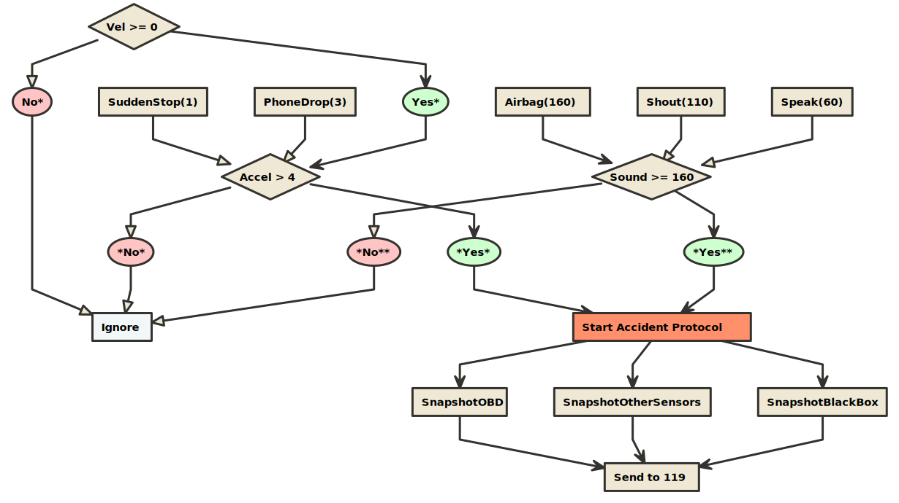
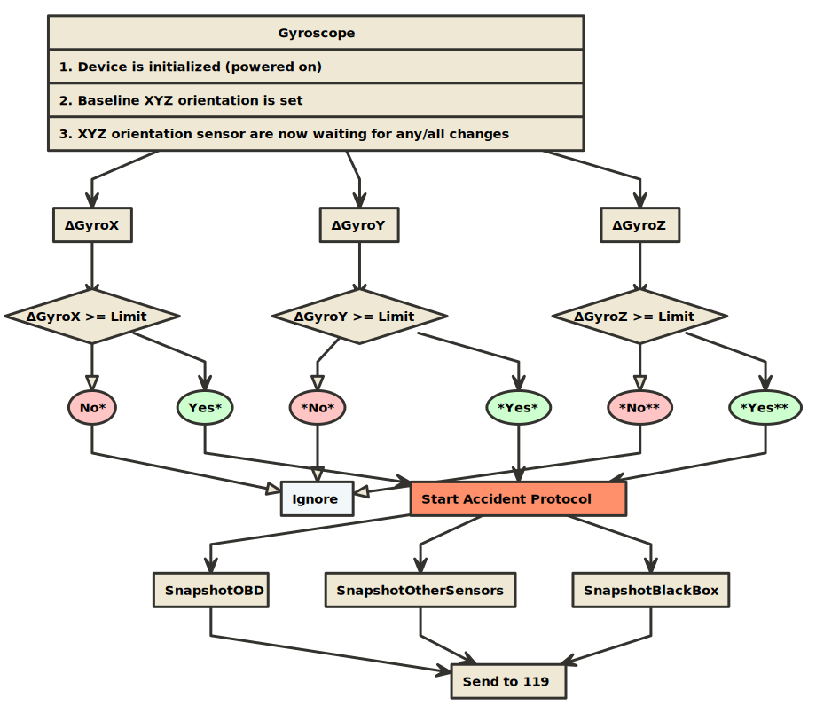
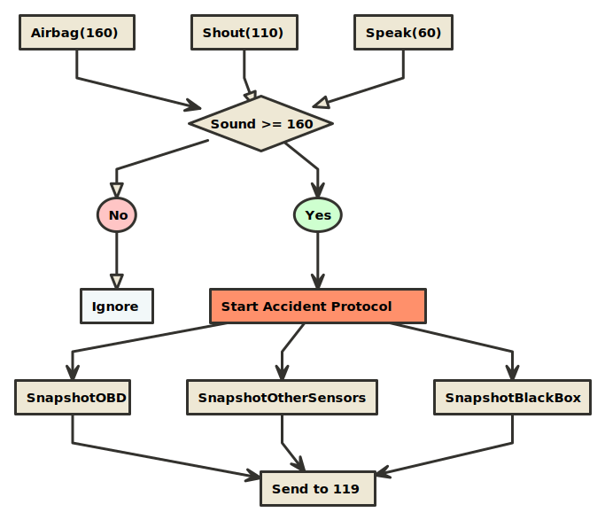

# Accident Scenarios

> Reference material for the Hyundai TIPS program application

### Velocity/acceleration scenario (a1)

> * Vel(km/h): vehicle (veh) velocity (vel) measured by the OBD (mOBD)
> * Accel(G): veh acceleration (accel) mOBD
> * SuddenStop(G): veh accel from driver-initiated stop mOBD
> * PhoneDrop(G): accel from dropped smartphone measure by smartphone
> * SnapshotOBD: last 15s of OBD data
> * SnapshotOtherSensors: last 15s of other sensor data (e.g. sound)
> * SnapshotBlackBox: last 15s of blackbox data

* Based on [this paper](https://drive.google.com/file/d/1QDbfbPimx4J_werIiUyXG3ZoOR6K9eps/view?usp=sharing)
* Begin recording accelerometer information and looking for potential accidents only above 15mph
* Ignore any acceleration events below a magnitude of 4G's
* This acceleration change should be enough to detect minor accidents, and is well below the threshold for airbag deployment (~60G's)
* Note: in the event of a sudden stop (driver initiated), although the change in velocity might be large, the actual acceleration event is small because the velocity change occurs over a longer time (unlikely to be greater than 4G's)
* A sudden stop generates approximately 1G [*](https://drive.google.com/file/d/1DYU_4OLVB49VQrmpePN6T9Jg_qmxFNcf/view?usp=sharing)
* When a smartphone is dropped inside a vehicle, it experiences approximately 2G's on the y/z axes, and 3G's on the x-axis before it comes to rest [*](https://drive.google.com/file/d/1DYU_4OLVB49VQrmpePN6T9Jg_qmxFNcf/view?usp=sharing)

### Large/sudden shift in gyroscope orientation scenario (a2)

> * GyroX: vehicle's orientation along the x-axis
> * GyroY: vehicle's orientation along the y-axis
> * GyroZ: vehicle's orientation along the z-axis

### Airbag acoustic event scenario (a3)

> * Sound(dB): in-vehicle sound pressure
> * Airbag(dB): in-vehicle sound pressure generated by airbag release
> * Shout(dB): in-vehicle sound pressure generated by person shouting
> * Speak(dB): in-vehicle sound pressure generated by people speaking

* Based on [this paper](https://drive.google.com/file/d/1DYU_4OLVB49VQrmpePN6T9Jg_qmxFNcf/view?usp=sharing)
* Glass breakage detectors usually use a microphone which measures any noise or vibrations coming from the vehicle's glass surfaces (narrowband microphones tuned to frequencies typical of glass shattering)
* Airbag deployment emits a high-decibal acoustic event

### Sample code for the scenario above...

> ...can be found [here](https://github.com/chousemath/accident_scenarios/blob/master/code/accident_a1.c)

### General Notes
* G-Force: acceleration force experienced by the vehicle occupant
* The soft crush of sheet metal produces low deceleration pulses in the vehicle
* The series of decelerations over a duration of +100ms of a crash may be called a `crash pulse` or a `deceleration curve`
* A crash pulse is characterized by `shape`, `amplitude`, and `duration`
* In the case of an accident, the smartphone experiences the same acceleration force experienced by the occupants of the vehicle, because smartphones are frequently carried in a pocket attached to the occupants

### Resources
* [Vehicle Accident Detection and Alerting System](https://drive.google.com/file/d/1whJGfI7QLJ5fAWR8xfjTuaIy_xNvX9FU/view?usp=sharing)
* [Vehicle Accident Automatic Detection and Remote Alarm Device](https://drive.google.com/file/d/1tEahVs4c9ry3DOEkpVku7I1m4XHZzCWr/view?usp=sharing)
* [Using Smartphones to Detect Car Accidents and Provide Situational Awareness to Emergency Responders](https://drive.google.com/file/d/1QDbfbPimx4J_werIiUyXG3ZoOR6K9eps/view?usp=sharing)
* [Solutions for acceleration measurement in vehicle crash tests](https://drive.google.com/file/d/16eFYnjP_QVrtOjLHeLgy-vnHx_6hArvV/view?usp=sharing)
* [Smart Accident Detection & Assistance System](https://drive.google.com/file/d/1vtiZ_JE33bkDKVtSgbMHtS9mzcfRQgLo/view?usp=sharing)
* [SENSOR BASED ACCIDENT DETECTION AND PREVENTION TECHNOLOGY](https://drive.google.com/file/d/171SN4d5lo06UgbVaNzxM595QA_zYX7My/view?usp=sharing)
* [Real Time Vehicle Accident Detection and Tracking Using GPS and GSM](https://drive.google.com/file/d/1RIa3qVR3eINVQUyTP2GogMVzPPTKqWvy/view?usp=sharing)
* [Car Accident Detection and Notification System Using Smartphone](https://drive.google.com/open?id=1DYU_4OLVB49VQrmpePN6T9Jg_qmxFNcf)
* [Automatic Vehicle Accident Detection and Messaging System Using GSM and GPS Modem](https://drive.google.com/file/d/1w-vxJ401utAMfdhR_oZRKpNnT0Qn8aDG/view?usp=sharing)
* [Automatic road accident detection techniques: A brief survey](https://drive.google.com/file/d/1YE1m0t6Q2QFngFNCkGdeHq-w1h4MnkYm/view?usp=sharing)
* [Automatic Accident Detection and Alerting System Based on IOT](https://drive.google.com/file/d/1De_9zCHEajPtiGBoniI1tQFemCQDMl3j/view?usp=sharing)
* [AN EFFICIENT VEHICLE ACCIDENT DETECTION USING SENSOR TECHNOLOGY](https://drive.google.com/file/d/1UHJQDrt2Tio3XM-UlL58pgms5CwNPqbo/view?usp=sharing)
* [ACCIDENT DETECTION SYSTEM AND METHOD FOR ACCIDENT DETECTION](https://drive.google.com/file/d/1P67Zx_lvv1nDwlR3glYUzx5-C2_c9G4-/view?usp=sharing)
* [ACCIDENT DETECTION AND REPORTING SYSTEM USING GPS, GPRS AND GSM TECHNOLOGY](https://drive.google.com/file/d/1jbD1_la1PNB-6C1mk1NgPduNVd7h9HIk/view?usp=sharing)
* [A Real-Time Autonomous Highway Accident Detection Model Based on Big Data Processing and Computational Intelligence](https://drive.google.com/file/d/1icFXESCYUh2d3nChG-KfaFoHMCal38uP/view?usp=sharing)
* [A Review Paper on Accident Detection System Using Intelligent Algorithm for VANET](https://drive.google.com/file/d/11jgWeSp5OAWxD12c3oR9s5I-uU5GqAgG/view?usp=sharing)
* [ACCIDENT DETECTION DEPENDING ON THE VEHICLE POSITION AND VEHICLE THEFT TRACKING, REPORTING SYSTEMS](https://drive.google.com/file/d/128h_E20QdvC6Hn77oJK5RjgFtdZJ5u4s/view?usp=sharing)
* [ACCIDENT DETECTION SYSTEM APPLICATION](https://drive.google.com/file/d/1lavEV9gpmVflaYyad0zArhtLH5VLF7fh/view?usp=sharing)
