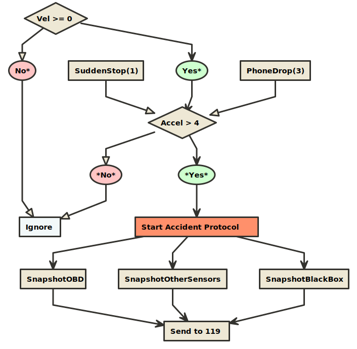

# Accident Scenarios

> Reference material for the Hyundai TIPS program application

### Velocity/acceleration + airbag acoustic event scenario (a1)



> * Vel(km/h): vehicle (veh) velocity (vel) measured by the OBD (mOBD)
> * Accel(G): veh acceleration (accel) mOBD
> * SuddenStop(G): veh accel from driver-initiated stop mOBD
> * PhoneDrop(G): accel from dropped smartphone measure by smartphone
> * Sound(dB): in-vehicle sound pressure
> * Airbag(dB): in-vehicle sound pressure generated by airbag release
> * Shout(dB): in-vehicle sound pressure generated by person shouting
> * Speak(dB): in-vehicle sound pressure generated by people speaking

* Based on [this paper](https://drive.google.com/file/d/1QDbfbPimx4J_werIiUyXG3ZoOR6K9eps/view?usp=sharing), and [this paper](https://drive.google.com/file/d/1DYU_4OLVB49VQrmpePN6T9Jg_qmxFNcf/view?usp=sharing)
* Begin recording accelerometer information and looking for potential accidents only above 15mph
* Ignore any acceleration events below a magnitude of 4G's
* This acceleration change should be enough to detect minor accidents, and is well below the threshold for airbag deployment (~60G's)
* Note: in the event of a sudden stop (driver initiated), although the change in velocity might be large, the actual acceleration event is small because the velocity change occurs over a longer time (unlikely to be greater than 4G's)
* A sudden stop generates approximately 1G [*](https://drive.google.com/file/d/1DYU_4OLVB49VQrmpePN6T9Jg_qmxFNcf/view?usp=sharing)
* When a smartphone is dropped inside a vehicle, it experiences approximately 2G's on the y/z axes, and 3G's on the x-axis before it comes to rest [*](https://drive.google.com/file/d/1DYU_4OLVB49VQrmpePN6T9Jg_qmxFNcf/view?usp=sharing)


```c
#include <assert.h>
#include <stdbool.h>

bool accident_detected(double vel, double accel) {
  if (vel >= 15 && accel >= 4) {
    return true;
  }
  return false;
}

int main() {
  assert(accident_detected(15, 4));
  assert(accident_detected(16, 5));
  assert(!accident_detected(13, 4));
  assert(!accident_detected(15, 3));
  return 0;
}
```

### General Notes
* G-Force: acceleration force experienced by the vehicle occupant
* The soft crush of sheet metal produces low deceleration pulses in the vehicle
* The series of decelerations over a duration of +100ms of a crash may be called a `crash pulse` or a `deceleration curve`
* A crash pulse is characterized by `shape`, `amplitude`, and `duration`
* Glass breakage detectors usually use a microphone which measures any noise or vibrations coming from the vehicle's glass surfaces (narrowband microphones tuned to frequencies typical of glass shattering)
* Airbag deployment emits a high-decibal acoustic event
* In the case of an accident, the smartphone experiences the same acceleration force experienced by the occupants of the vehicle, because smartphones are frequently carried in a pocket attached to the occupants
