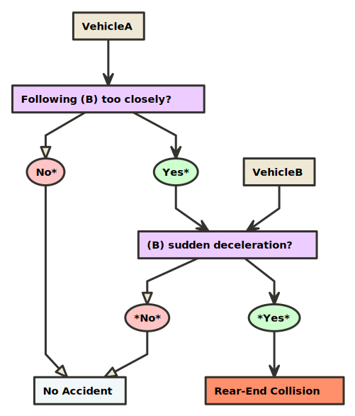

# Accident Scenarios

> Reference material for the Hyundai TIPS program application

### Imaginary accident scenarios

##### *Spending too much time at an intersection*

> If a vehicle spends too long at an intersection, that is a good sign that that vehicle has been involved in some kind of accident (unless it is an extremely busy intersection, like 강남).

### Real accident case studies

##### [Accident case study 1](https://www.traceysolicitors.ie/en/car-accident-case-study/)

> Ciaran works for a logistics food delivery company and was walking from the driver’s door to the back of the van when a car came from behind the van and hit his left forearm and left wrist area. His left forearm and wrist area hit off the wing mirror of the car as it came through a very tight gap between Ciaran’s van and other traffic. The impact caused the mirror to be folded in. He was shocked but felt fine to begin with and carried on doing his deliveries. Later in the evening, he noted pain in his mid forearm and which worsened by the next morning. When he visited his doctor, he was diagnosed with soft tissue damage and it was not possible to put a time frame on his recovery. Ciaran could not put weight on his arm and said it was ‘like the sensation of a dead leg but in the arm’.

##### [Accident case study 2](https://www.digbybrown.co.uk//solicitors/clients/ten-fold-increase-for-injured-passenger-with-expert-lawyers)

> Mr Conway was a passenger in a car when he was injured in road traffic accident in the Highlands. The driver was travelling at speed along an icy rural road before losing control and colliding with a tree. The driver was also under the influence of alcohol at the time of the incident. Mr Conway suffered serious physical and psychological injuries including a fractured back and serious injury to his shoulder which drastically impacted his ability to work. Mr Conway then approached Digby Brown to pursue an road injury claim on his behalf.

### Velocity/acceleration based detection system

> * Vel(km/h): vehicle (veh) velocity (vel) measured by the OBD (mOBD)
> * Accel(G): veh acceleration (accel) mOBD
> * SuddenStop(G): veh accel from driver-initiated stop mOBD
> * PhoneDrop(G): accel from dropped smartphone measure by smartphone
> * SnapshotOBD: last 15s of OBD data
> * SnapshotOtherSensors: last 15s of other sensor data (e.g. sound)
> * SnapshotBlackBox: last 15s of blackbox data

* Based on [this paper](https://drive.google.com/file/d/1QDbfbPimx4J_werIiUyXG3ZoOR6K9eps/view?usp=sharing)
* Begin recording accelerometer information and looking for potential accidents only above 15mph
* Ignore any acceleration events below a magnitude of 4G's
* This acceleration change should be enough to detect minor accidents, and is well below the threshold for airbag deployment (~60G's)
* Note: in the event of a sudden stop (driver initiated), although the change in velocity might be large, the actual acceleration event is small because the velocity change occurs over a longer time (unlikely to be greater than 4G's)
* A sudden stop generates approximately 1G [*](https://drive.google.com/file/d/1DYU_4OLVB49VQrmpePN6T9Jg_qmxFNcf/view?usp=sharing)
* When a smartphone is dropped inside a vehicle, it experiences approximately 2G's on the y/z axes, and 3G's on the x-axis before it comes to rest [*](https://drive.google.com/file/d/1DYU_4OLVB49VQrmpePN6T9Jg_qmxFNcf/view?usp=sharing)

### Gyroscope-based detection system

> * GyroX: vehicle's orientation along the x-axis
> * GyroY: vehicle's orientation along the y-axis
> * GyroZ: vehicle's orientation along the z-axis
> * Vehicle rollover — Vehicle rollover accidents are extremely dangerous and frightening. A rollover occurs when a vehicle literally flips over onto its side or roof. Any vehicle can be involved in a rollover accident, but cars with a high center of gravity such as SUVs (sport utility vehicles) are especially prone to this type of accident. Often caused by sharp turns at high speed, rollover accidents can lead to serious injuries, including spinal cord injuries and brain trauma.

### Airbag acoustics-based detection system

> * Sound(dB): in-vehicle sound pressure
> * Airbag(dB): in-vehicle sound pressure generated by airbag release
> * Shout(dB): in-vehicle sound pressure generated by person shouting
> * Speak(dB): in-vehicle sound pressure generated by people speaking

* Based on [this paper](https://drive.google.com/file/d/1DYU_4OLVB49VQrmpePN6T9Jg_qmxFNcf/view?usp=sharing)
* Glass breakage detectors usually use a microphone which measures any noise or vibrations coming from the vehicle's glass surfaces (narrowband microphones tuned to frequencies typical of glass shattering)
* Airbag deployment emits a high-decibal acoustic event

### Sample code for the scenario above...

> ...can be found [here](https://github.com/chousemath/accident_scenarios/blob/master/code/accident_a1.c)

### Common minor vehicle accidents

##### *Rear-end collisions*

> These types of traffic accidents are often caused by sudden deceleration (slowing down or braking). In some cases, another driver is following too closely or accelerates to a higher speed than the car in front of it.

##### *T-Bone or Cross-Traffic Accidents*

> Collisions at an intersection where traffic crosses are most often called T-bone accidents. These are usually caused by a driver running a red light or stop sign or taking a left turn without yielding to oncoming traffic. Since most T-bone crashes are caused by the negligence of a driver, the best way to avoid these crashes is to follow traffic laws. Unfortunately, not everyone is responsible about this. In order to prevent being a victim of another person’s poor driving, take extra caution when driving through intersections and watch out for any signs that the other driver is distracted and not paying attention. It can be impacted by the front or rear of another vehicle or in some cases a fixed object. Vehicle damage is often severe and drivers or passengers on the impacted side of the vehicle usually sustain far worse injuries than they would in another type of crash.

##### Clipping Other Cars When Merging

> Merging cars (and cars around the merging vehicle) are at risk of being sideswiped. These types of car crashes generally caused by a failure of the merging driver to check all blind spots. In order to void these crashes, always look around you and check blind spots before changing lanes. Also, don’t speed, especially in areas where other drivers commonly will be merging. You may make it more difficult for them to properly see you when checking in blind spots.

* Sideswipe collisions — Sideswipe collisions occur when two cars that are parallel touch. In many cases, the damage is only minor, as the cars have just "swiped" each other. Injuries and damages are typically minimal, unless one of the drivers loses control of the vehicle as a result of the collision.

* Head-on collisions — These types of collisions are often fatal. Head-on collisions are exactly what they sound like — they occur when the front ends of two vehicles impact each other.

* Single-car accidents — Accidents involving only one vehicle are also common. They occur when a vehicle strikes an object such as a pole, a tree, a fire hydrant or a wall. In some cases, they may involve pedestrians and other innocent bystanders. Single-car collisions can result in driver and passenger injuries, pedestrian injuries, and often extensive property damage.

* Multiple vehicle collisions — Multiple vehicle collisions are sometimes referred to as "pile-ups" and often occur on busy roads such as highways and freeways. They can involve many vehicles and be the most dangerous. Vehicles can be impacted multiple times and it may be difficult to escape. It is also difficult to determine fault in these cases.

* Hit-and-run accidents — An accident where one driver leaves the scene is known as a hit-and-run accident. It can be very difficult to determine the identity of the driver or vehicle.

* Low Speed Accidents - Low speed impact crashes may not be the worst, but they can still do damage. These fender-benders, bumps, parking lot collisions, and other crashes under the speed of ten miles per hour can often happen in parking lots and residential areas, risking pedestrian lives. You must always be on the lookout for pedestrians in neighborhoods and other common pedestrian areas, and you should never speed. Even at low speeds, pedestrian accidents can result in serious injury. Since many low speed crashes happen while drivers are backing up, take extra care to look out for other drivers before reversing.

### User stories

* Story 1 - You make a quick run to your local grocery store after work to pick up a few items you’ll need for dinner. You get in and out of the store without too much waiting or hassle despite it being that time of day when everyone seems to need bread and eggs. You walk to your car, start it up, and pull out of your parking space. As you edge toward the parking lot exit, another driver is backing out of a parking space and doesn’t see you. Before you know it, the other driver is colliding with you. You feel a shaken, but you were wearing your seat belt and don’t think you’re hurt, and there doesn’t appear to be any damage to your car.

* Story 2 - You’re sitting in stop-and-go traffic, which can be a pretty common scenario anywhere in Chicago during rush hour. Every few minutes, you may get to move a few feet. Cars are bumper-to-bumper, and everyone is just hoping that the bottleneck will uncork and they can start moving at a reasonable speed. Sometimes the person behind you might jump the gun a little and bump you in their eagerness to get moving. They weren’t moving very fast, and you don’t see any damage to your car or feel like you’re injured. You go ahead and trade insurance information, but you don’t really expect to have to make a claim. You may not even make an accident report because you don’t think it’s worth the time.

* Story 3 - A side impact collision, sometimes referred to as a T-bone crash, often comes out of nowhere. You were following the rules, but someone else ran a red light or a stop sign and slammed into the side of your car. These kinds of collisions can result in serious injuries and damage. Unlike head-on or rear-end collisions where the front or back end of your car may crumple and absorb some of the impact, when you’re hit from the side there’s little between you and the impact. Much of that force hits you directly, and the results can be very painful.

* Story 4 - Turning left in busy intersections can be challenging since it requires drivers to make a series of complex decisions in a short period of time. Left turns are one of the riskiest driving maneuvers and are dangerous for both motorists and pedestrians.

### General Notes
* G-Force: acceleration force experienced by the vehicle occupant
* The soft crush of sheet metal produces low deceleration pulses in the vehicle
* The series of decelerations over a duration of +100ms of a crash may be called a `crash pulse` or a `deceleration curve`
* A crash pulse is characterized by `shape`, `amplitude`, and `duration`
* In the case of an accident, the smartphone experiences the same acceleration force experienced by the occupants of the vehicle, because smartphones are frequently carried in a pocket attached to the occupants

### Resources
* [Vehicle Accident Detection and Alerting System](https://drive.google.com/file/d/1whJGfI7QLJ5fAWR8xfjTuaIy_xNvX9FU/view?usp=sharing)
* [Vehicle Accident Automatic Detection and Remote Alarm Device](https://drive.google.com/file/d/1tEahVs4c9ry3DOEkpVku7I1m4XHZzCWr/view?usp=sharing)
* [Using Smartphones to Detect Car Accidents and Provide Situational Awareness to Emergency Responders](https://drive.google.com/file/d/1QDbfbPimx4J_werIiUyXG3ZoOR6K9eps/view?usp=sharing)
* [Solutions for acceleration measurement in vehicle crash tests](https://drive.google.com/file/d/16eFYnjP_QVrtOjLHeLgy-vnHx_6hArvV/view?usp=sharing)
* [Smart Accident Detection & Assistance System](https://drive.google.com/file/d/1vtiZ_JE33bkDKVtSgbMHtS9mzcfRQgLo/view?usp=sharing)
* [SENSOR BASED ACCIDENT DETECTION AND PREVENTION TECHNOLOGY](https://drive.google.com/file/d/171SN4d5lo06UgbVaNzxM595QA_zYX7My/view?usp=sharing)
* [Real Time Vehicle Accident Detection and Tracking Using GPS and GSM](https://drive.google.com/file/d/1RIa3qVR3eINVQUyTP2GogMVzPPTKqWvy/view?usp=sharing)
* [Car Accident Detection and Notification System Using Smartphone](https://drive.google.com/open?id=1DYU_4OLVB49VQrmpePN6T9Jg_qmxFNcf)
* [Automatic Vehicle Accident Detection and Messaging System Using GSM and GPS Modem](https://drive.google.com/file/d/1w-vxJ401utAMfdhR_oZRKpNnT0Qn8aDG/view?usp=sharing)
* [Automatic road accident detection techniques: A brief survey](https://drive.google.com/file/d/1YE1m0t6Q2QFngFNCkGdeHq-w1h4MnkYm/view?usp=sharing)
* [Automatic Accident Detection and Alerting System Based on IOT](https://drive.google.com/file/d/1De_9zCHEajPtiGBoniI1tQFemCQDMl3j/view?usp=sharing)
* [AN EFFICIENT VEHICLE ACCIDENT DETECTION USING SENSOR TECHNOLOGY](https://drive.google.com/file/d/1UHJQDrt2Tio3XM-UlL58pgms5CwNPqbo/view?usp=sharing)
* [ACCIDENT DETECTION SYSTEM AND METHOD FOR ACCIDENT DETECTION](https://drive.google.com/file/d/1P67Zx_lvv1nDwlR3glYUzx5-C2_c9G4-/view?usp=sharing)
* [ACCIDENT DETECTION AND REPORTING SYSTEM USING GPS, GPRS AND GSM TECHNOLOGY](https://drive.google.com/file/d/1jbD1_la1PNB-6C1mk1NgPduNVd7h9HIk/view?usp=sharing)
* [A Real-Time Autonomous Highway Accident Detection Model Based on Big Data Processing and Computational Intelligence](https://drive.google.com/file/d/1icFXESCYUh2d3nChG-KfaFoHMCal38uP/view?usp=sharing)
* [A Review Paper on Accident Detection System Using Intelligent Algorithm for VANET](https://drive.google.com/file/d/11jgWeSp5OAWxD12c3oR9s5I-uU5GqAgG/view?usp=sharing)
* [ACCIDENT DETECTION DEPENDING ON THE VEHICLE POSITION AND VEHICLE THEFT TRACKING, REPORTING SYSTEMS](https://drive.google.com/file/d/128h_E20QdvC6Hn77oJK5RjgFtdZJ5u4s/view?usp=sharing)
* [ACCIDENT DETECTION SYSTEM APPLICATION](https://drive.google.com/file/d/1lavEV9gpmVflaYyad0zArhtLH5VLF7fh/view?usp=sharing)

### Other project ideas

##### Speech-pattern drunk driving prevention system

> The idea of this system is to prevent a drunk driver from starting their car. Instead of using a chemical sensor, we can use the user's speech pattern to prevent him/her from starting their car. When sober, the user is prompted to read several stories. The machine learning algorithm learns the user's speech pattern, and then generates a new, similar (but different) story every time the user wants to start their car. The assumption is that when a user is drunk, and reading the new story, their speech pattern will be noticeably different from when they are sober.

